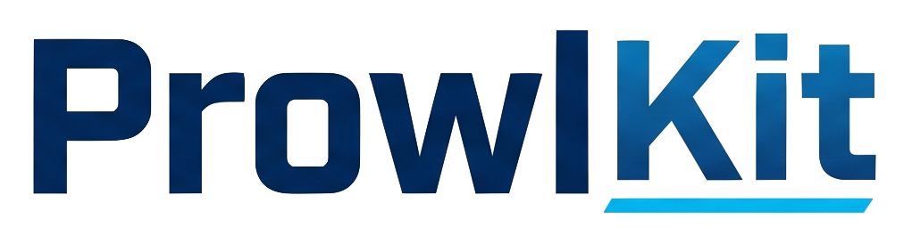
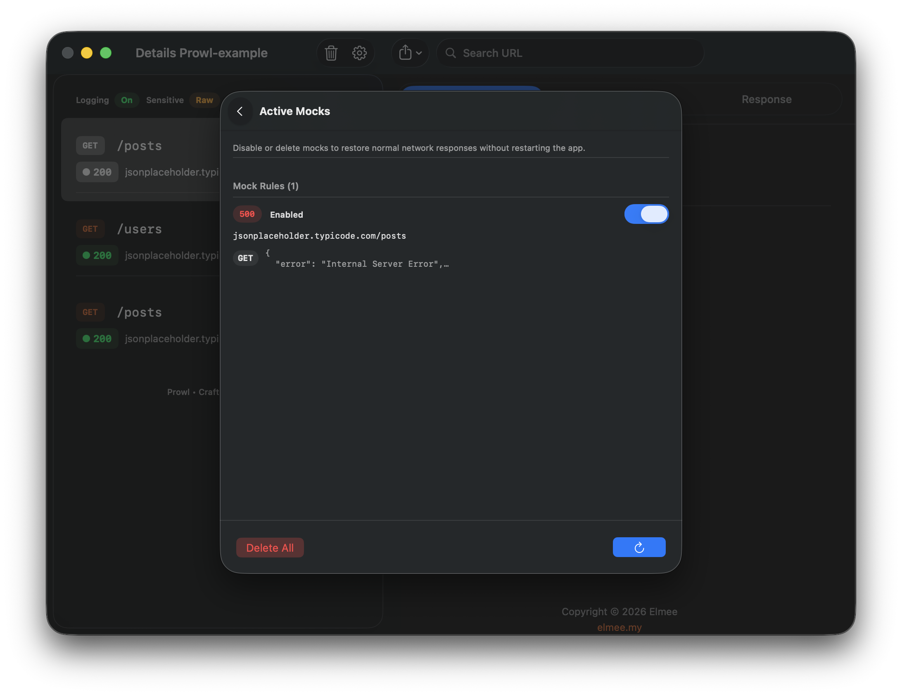
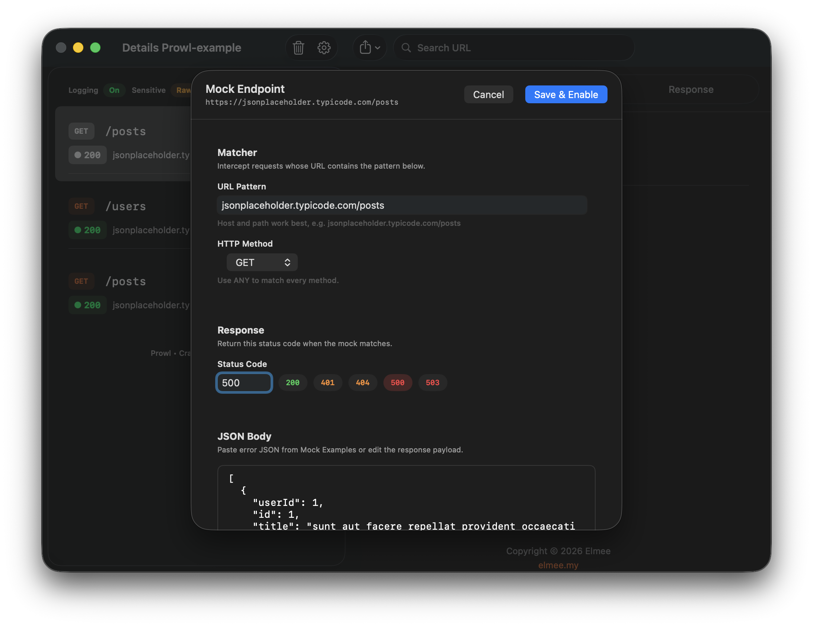
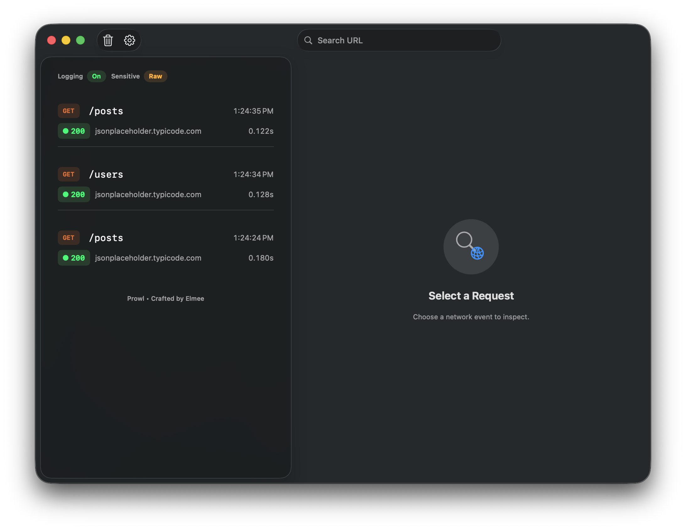
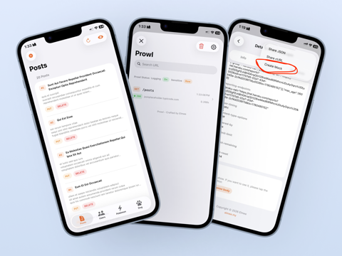
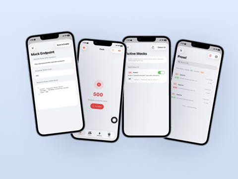

# ProwlKit

<p align="center">
  
</p>

<p align="center">
  <a href="https://github.com/ProwlLabs/prowlkit-ios/releases/latest"></a>
  <a href="https://github.com/ProwlLabs/prowlkit-ios/actions/workflows/ci.yml"></a>
  
  
  
</p>

<p align="center">
  A lightweight network debugger for the Apple ecosystem — URL interception, sensitive-data masking,<br>
  and a built-in SwiftUI inspector. Native <code>Foundation</code> + <code>SwiftUI</code>. Swift Package Manager only.
</p>

## Preview

<table>
  <tr>
    <td align="center" width="50%">
      <strong>macOS</strong><br>
      Menu bar · <kbd>⌘</kbd><kbd>⇧</kbd><kbd>P</kbd> · live request log<br><br>
      
    </td>
    <td align="center" width="50%">
      <strong>iOS</strong><br>
      Shake to toggle · search · inspect<br><br>
      
    </td>
  </tr>
</table>

### macOS

<p align="center">
  
</p>

<p align="center">
  
  &nbsp;&nbsp;
  
</p>

<p align="center">
  
  &nbsp; Menu bar icon — open the inspector from anywhere on macOS
</p>

### iOS

<p align="center">
  
  &nbsp;&nbsp;&nbsp;
  
</p>

## Features

- URL interception via `URLProtocol`
- Runtime logging toggle (pause/resume interception)
- Thread-safe log storage via `actor`
- FIFO log buffer (default `200`)
- Session persistence across app launches (optional)
- Built-in sensitive data masking (toggleable at runtime)
- Response mocking with delay, reorder, and JSON import/export
- Request rewrite rules (URL, headers, body)
- SwiftUI inspector dashboard + detail tabs (timing, host IP, multipart)
- Real-time search with syntax (`method:`, `status:`, `host:`) and watch/pin
- URL ignore rules via substring and regex pattern
- Endpoint rate alerts
- Export logs as formatted text, cURL, or HAR 1.2
- WebSocket and gRPC manual logging hooks
- Optional gRPC Swift 2 interceptor (`ProwlGRPC` product, iOS 18+)
- Activation shortcuts:
  - iOS shake gesture & floating debug bubble
  - macOS menu bar popover + `Command + Shift + P`

## Prowl CLI (macOS)

Terminal companion for Prowl — live relay, session discovery, and export. Requires macOS 12+.

### Quick start (terminal-first)

**Homebrew (recommended):**

```bash
brew install ProwlKit/prowlkit-ios/prowl
# or latest main while waiting for a tagged CLI release:
brew install --HEAD ProwlKit/prowlkit-ios/prowl
prowl listen
```

**One-liner (curl):**

```bash
curl -fsSL https://raw.githubusercontent.com/ProwlKit/prowlkit-ios/main/Scripts/install.sh | bash
prowl listen
```

**From a local clone:**

```bash
cd prowlkit-ios
prowl install --user          # download release or build from source
prowl listen                  # default command — streams live traffic
```

In another terminal, run your app (macOS or iOS Simulator) with ProwlKit:

```swift
#if DEBUG
Prowl.relayEndpoint = URL(string: "http://127.0.0.1:9284")!
#endif
Prowl.start()
```

Or set `PROWL_RELAY=1` in your Xcode scheme environment variables.

### Install

| Method | Command |
|--------|---------|
| **Homebrew** | `brew install ProwlKit/prowlkit-ios/prowl` |
| **curl script** | `curl -fsSL https://raw.githubusercontent.com/ProwlKit/prowlkit-ios/main/Scripts/install.sh \| bash` |
| **prowl CLI** | `prowl install --user` (downloads latest release binary) |
| **From source** | `PROWL_FROM_SOURCE=1 curl -fsSL .../install.sh \| bash` or `prowl install --from-source` |

Homebrew installs from source via SwiftPM (requires Xcode 15+). The curl script and `prowl install` prefer prebuilt binaries from [GitHub Releases](https://github.com/ProwlKit/prowlkit-ios/releases) and fall back to a source build.

Install to a custom directory:

```bash
PROWL_INSTALL_DIR=/opt/bin curl -fsSL .../install.sh | bash
```

Pin a release version:

```bash
PROWL_VERSION=1.1.0 curl -fsSL .../install.sh | bash
prowl install --user --version 1.1.0
```

Run without installing:

```bash
swift run prowl listen
swift run prowl --help
```

### Commands

```bash
# Live traffic (default when you run `prowl` with no subcommand)
prowl listen
prowl listen --port 9284

# Discover apps / sessions on this Mac
prowl sessions                # macOS + iOS Simulator session files
prowl devices                 # booted simulators + macOS status
prowl doctor                  # check CLI, relay port, discovery

# Tail a session file
prowl watch
prowl watch ~/path/to/prowl_session.json

# Inspect saved sessions
prowl show
prowl show session.json --filter "method:GET status:2xx"
prowl show session.json --verbose

# Export
prowl export session.json --format har -o traffic.har
prowl export session.json --format curl -o replay.sh
prowl export session.json --format text
prowl export session.json --format json

# Redact secrets before sharing
prowl redact session.json -o safe-session.json
```

Enable session persistence so `prowl sessions` can find offline logs:

```swift
Prowl.isSessionPersistenceEnabled = true
```

## Install (SPM)

In Xcode:

1. `File` -> `Add Package Dependencies...`
2. Enter your repository URL for Prowl
3. Select dependency rule version:
   - `Up to Next Major Version` (recommended), starting from the latest release
   - `Up to Next Minor Version`
   - `Exact Version` (locked)
4. Add the `Prowl` product to your app target

**Version strategy**

- **Stable updates (recommended):** `Up to Next Major` from the latest release tag
- **Strict lock for CI/release:** `Exact` to a specific release tag

If you use `Package.swift` directly, pin like this:

```swift
dependencies: [
    .package(url: "https://github.com/ProwlLabs/prowlkit-ios.git", exact: "<latest-release-tag>")
]
```

## Public API Reference

All APIs live on the `Prowl` facade (`import ProwlKit`). Members are `@MainActor` — call from the main thread or inside a `@MainActor` context. Mock and rewrite helpers are `async`.

For narrative guides and symbol cross-links, see the [DocC documentation](#documentation) (`PublicAPIReference`, `GettingStarted`, `Configuration`, `AdvancedFeatures`, `HTTPClientIntegrations`).

### Lifecycle

Call `Prowl.start()` once at app startup. No extra view modifier is required.

```swift
import ProwlKit

@main
struct DemoApp: App {
    init() {
        Prowl.start()
    }

    var body: some Scene {
        WindowGroup { ContentView() }
    }
}
```

```swift
// Start with optional ignore rules (idempotent)
Prowl.start(
    ignoredURLs: ["https://firebaselogging.googleapis.com"],
    ignoredURLRegexes: [#"https://telemetry\.[^/]+/collect"#]
)

// Inspector UI
Prowl.show()
Prowl.hide()
Prowl.toggle()

// Stop interception (logs are kept)
Prowl.stop()
```

After `Prowl.start()`:

- **iOS** — shake device to toggle the inspector
- **macOS** — click the **Prowl** menu-bar icon (**⌘⇧P**)

### Ignore rules

```swift
Prowl.ignoreURL("https://res.cloudinary.com/")
Prowl.ignoreURL(regex: #"https://api\.example\.com/v[0-9]+/health"#)

Prowl.ignoredURLs = ["https://analytics.example.com"]
Prowl.ignoredURLRegexes = [#"https://.*\.internal/.*"#]
```

### Storage, configuration, and masking

`Prowl.configure(...)` is `async` — always `await` it before `Prowl.start()` when order matters.

```swift
import ProwlKit
import ProwlCore

let storage = ProwlStorage(limit: 500)
let masker = SensitiveDataMasker(
    sensitiveHeaders: ["authorization", "cookie", "x-api-key"],
    sensitiveJSONKeys: ["password", "token", "accessToken"]
)

Task { @MainActor in
    await Prowl.configure(
        storage: storage,
        masker: masker,
        isLoggingEnabled: true,
        isSensitiveDataMaskingEnabled: false
    )
    Prowl.start()
}

Task {
    let store = await Prowl.storage()
    let logs = await store.allLogs()
}
```

Masking defaults to **off** (raw values shown). Toggle at runtime:

```swift
Prowl.isSensitiveDataMaskingEnabled = true
```

### Runtime flags

```swift
Prowl.isLoggingEnabled = false 
Prowl.isLoggingEnabled = true

Prowl.isSessionPersistenceEnabled = true
```

### Custom URLSessionDelegate (pinning / mTLS)

Set before `Prowl.start()`:

```swift
final class MySessionDelegate: NSObject, URLSessionDelegate {
    // Certificate pinning / trust handling
}

Prowl.customSessionDelegate = MySessionDelegate()
Prowl.start()
```

### Response body transform (logging only)

Implement `ProwlResponseBodyLoggingTransforming` to decode encrypted or encoded payloads **for display only**. The live `URLSession` response is unchanged.

```swift
import ProwlKit
import ProwlCore

final class MyDecryptor: ProwlResponseBodyLoggingTransforming {
    func responseBodyForLogging(
        data: Data,
        contentType: String?,
        url: URL?,
        statusCode: Int?
    ) -> Data? {
        nil // return decoded bytes, or nil to keep the original payload
    }
}

Prowl.responseBodyLoggingTransformer = MyDecryptor()
Prowl.start()
```

### Endpoint rate alerts

Flag noisy endpoints when traffic crosses a threshold (per HTTP method + host + path, query ignored). The request that hits the threshold gets `NetworkLog.endpointRateAlertTriggered == true`.

```swift
Prowl.endpointRateAlertRules = [
    .init(match: .urlContains("https://api.example.com/v1/search"), threshold: 50),
    .init(match: .urlRegularExpression(pattern: #"https://telemetry\.[^/]+/collect"#), threshold: 20)
]

Prowl.resetEndpointRateAlertCounters() // also resets when you clear logs in the inspector
```

### Response mocking

Create rules from the inspector (**Share → Create Mock**) or programmatically. Rules persist to disk and reload on `Prowl.start()`.

```swift
import ProwlKit
import ProwlCore

Task { @MainActor in
    let rule = ProwlMockRule(
        targetURLPattern: "/api/users",
        targetMethod: "GET",
        mockStatusCode: 200,
        mockBody: Data(#"{"users":[]}"#.utf8),
        mockHeaders: ["Content-Type": "application/json; charset=utf-8"],
        responseDelayMillis: 300
    )

    await Prowl.addMockRule(rule)
    await Prowl.mockRules()
    await Prowl.saveMockRule(rule)
    await Prowl.moveMockRuleUp(id: rule.id)
    await Prowl.moveMockRuleDown(id: rule.id)
    await Prowl.setMockRuleEnabled(id: rule.id, enabled: false)
    await Prowl.removeMockRule(id: rule.id)
    await Prowl.removeAllMockRules()
}
```

Use a **specific URL pattern** so unrelated endpoints are not mocked.

### Request rewrite rules

Rewrite outgoing requests before they hit the network (separate from response mocks):

```swift
Task { @MainActor in
    let rule = ProwlRequestRewriteRule(
        targetURLPattern: "api.staging.example.com",
        targetMethod: "ANY",
        replacementURL: "https://api.example.com",
        headerOverrides: ["X-Env": "dev"],
        headersToRemove: ["X-Old-Header"]
    )

    await Prowl.addRequestRewriteRule(rule)
    await Prowl.requestRewriteRules()
    await Prowl.saveRequestRewriteRule(rule)
    await Prowl.setRequestRewriteRuleEnabled(id: rule.id, enabled: false)
    await Prowl.removeRequestRewriteRule(id: rule.id)
    await Prowl.removeAllRequestRewriteRules()
}
```

### WebSocket logging

Prowl does not auto-intercept WebSockets — call the hook from your client or use `ProwlWebSocketMonitor`:

```swift
import ProwlKit
import ProwlCore

let connectionID = UUID()
let url = URL(string: "wss://echo.example.com")!

Task { @MainActor in
    await Prowl.logWebSocketEvent(url: url, event: .open, connectionID: connectionID)
    await Prowl.logWebSocketEvent(url: url, event: .message(text: #"{"hello":"world"}"#), connectionID: connectionID)
    await Prowl.logWebSocketEvent(url: url, event: .closed(code: 1000, reason: "done"), connectionID: connectionID)
}

let task = URLSession.shared.webSocketTask(with: url)
let monitor = ProwlWebSocketMonitor(url: url)
monitor.attach(to: task)
task.resume()
// monitor.logIncomingMessage(message)
```

### gRPC logging

**gRPC Swift 2 (optional, iOS 18+)**

```swift
import GRPCCore
import ProwlGRPC

try await withGRPCClient(
    transport: transport,
    interceptors: [ProwlGrpcSwiftClientInterceptor.registration()]
) { client in
    // invoke generated service methods
}
```

**Manual hook**

Log from your gRPC client interceptor:

```swift
Task { @MainActor in
    await Prowl.logGrpcCall(
        fullMethodName: "/my.package.Service/GetUser",
        methodType: "UNARY",
        requestBody: Data(#"{"id":1}"#.utf8),
        responseBody: Data(#"{"name":"Ada"}"#.utf8),
        grpcStatusCode: 0,
        duration: 0.042
    )
}
```

### Export logs

Inspector toolbar: **Formatted Text**, **cURL Commands**, or **HAR 1.2** (iOS share sheet, macOS save panel).

```swift
Task {
    let storage = await Prowl.storage()
    let logs = await storage.allLogs()
    let text = ProwlLogFormatter.export(logs: logs, as: .formattedText)
    let curl = ProwlLogFormatter.export(logs: logs, as: .curlCommands)
    let har = ProwlLogFormatter.export(logs: logs, as: .har)
}
```

### Search syntax

In the inspector search bar, or programmatically:

```swift
import ProwlCore

let query = ProwlSearchParser.parse("method:GET status:4xx host:api.example.com users")
let matches = logs.filter { ProwlSearchParser.matches($0, query: query) }
```

Supported tokens: `method:GET`, `status:404`, `status:4xx`, `host:example.com`, plus free-text tokens.

### Manual inspector view

```swift
import SwiftUI
import ProwlUI

struct DebugPanelHost: View {
    var body: some View {
        ProwlInspectorView()
    }
}
```

### HTTP client integrations

Prowl reads `httpBody`, `httpBodyStream`, and metadata snapshots. At `Prowl.start()`, `URLSession.uploadTask(with:from:)` payloads are auto-attached for logging.

**Stream / manual snapshot**

```swift
import ProwlCore

var request = URLRequest(url: endpoint)
request.httpMethod = "POST"

let payload = try JSONEncoder().encode(body)
request.httpBodyStream = InputStream(data: payload)
request.attachProwlBodySnapshot(payload)

// or: request.setProwlHTTPBodyStream(payload)
let task = URLSession.shared.prowlUploadTask(withStreamedRequest: request, bodySnapshot: payload)
task.resume()
```

**Alamofire**

```swift
import Alamofire
import ProwlCore

let session = Session(
    configuration: .default,
    interceptor: ProwlAlamofireBodySnapshotInterceptor()
)
```

**Moya**

```swift
import Moya
import ProwlCore

let provider = MoyaProvider<MyTarget>(
    plugins: [ProwlMoyaBodySnapshotPlugin()]
)
```

## Example App

A complete usage example lives in the sibling project [**Prowl-example**](../Prowl-example) 

- iOS tabs with live API traffic
- macOS menu bar inspector integration
- mock/edit flows and export actions
- **API** playground covering every public `Prowl` facade method

## Upgrade Guide

- Prefer upgrading by immutable tags (`1.0.x`) instead of floating revisions.
- If you hit SPM cache mismatch after tag updates, reset package caches in Xcode and re-resolve packages.
- After upgrading, run with `Prowl.isSensitiveDataMaskingEnabled = false` first for parity checks, then enable masking if needed.

## Troubleshooting

- **CI iOS build fails with `cannot find <symbol> in scope`** — usually access-level changes across package targets; prefer `package` visibility for cross-target internals.
- **`swift test` passes but iOS package build fails** — run `xcodebuild` package scheme checks locally; iOS-only paths can be skipped by macOS test runs.
- **SPM tag/revision conflicts** — ensure release tags are immutable and never retag existing versions.

## Public API Policy

- `Prowl` facade remains the main public entrypoint.
- Core internals should stay `package`/`internal` unless there is a clear consumer need.
- Any new public API should be documented in this README and added to `CHANGELOG.md`.

## Release Checklist

1. Ensure tests pass: `swift test`
2. Verify CI is green on both configured Xcode lanes (`latest-stable` and pinned lane).
3. Review public API surface (only intentional symbols should remain `public`).
4. Validate docs examples in this `README.md` still match current behavior.
5. Run `swift-format lint -r Sources Tests` and resolve findings.
6. Create an immutable annotated tag and push it:

```bash
git tag -a <version> -m "Release <version>"
git push origin <version>
```

7. Create GitHub release notes using `.github/RELEASE_TEMPLATE.md`.
8. Update `CHANGELOG.md` with release notes summary.

## Notes

- Prowl uses native APIs only (no third-party dependencies).
- Log capture is designed to be idempotent and avoid side effects to host networking behavior.
- `URLProtocol` loop prevention is handled internally.
- Distributed via Swift Package Manager only — no CocoaPods spec is published.
- See `CONTRIBUTING.md` for development guidelines and `SECURITY.md` for disclosure policy.

## Documentation

Full **DocC** documentation ships with the `ProwlKit` target:

| Resource | Path |
| --- | --- |
| Module landing | `Sources/ProwlKit/ProwlKit.docc/ProwlKit.md` |
| Getting Started | `Sources/ProwlKit/ProwlKit.docc/GettingStarted.md` |
| Public API Reference | `Sources/ProwlKit/ProwlKit.docc/PublicAPIReference.md` |
| Configuration | `Sources/ProwlKit/ProwlKit.docc/Configuration.md` |
| Advanced Features | `Sources/ProwlKit/ProwlKit.docc/AdvancedFeatures.md` |
| HTTP Client Integrations | `Sources/ProwlKit/ProwlKit.docc/HTTPClientIntegrations.md` |
| gRPC Integrations | `Sources/ProwlKit/ProwlKit.docc/GRPCIntegrations.md` |

In Xcode: **Product → Build Documentation**. The [Swift Package Index](https://swiftpackageindex.com) renders the catalogue from tagged releases.

## License

Distributed under the MIT License — see [`LICENSE`](LICENSE).
